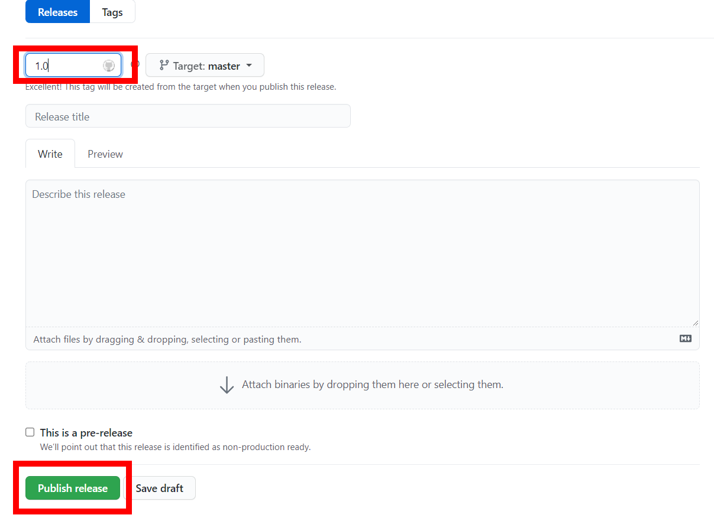

# Continous Delivery with CML, Github Actions and Watson ML

To deploy or update the deployment without the need to manually do so by the Watson ML UI or by running a script, we use GItHub Actions to run a workflow everytime we make a new release and then deploy the model that way. 

## Creating a Release

1. On GitHub, go to the main page of the repository.
2. To the right of the page, click on ```Releases``` or ```Latest release```.
 <div style="text-align:center"></div>
3. Click ```Draft a new release``` on the top right.
 <div style="text-align:center"></div>
4. Type the version of the new release.
5. Click on ```Publish release```.
 <div style="text-align:center"></div>

After that, Actions will trigger and the model on Watson ML, next we will explain how to implement this workflow. For more information regarding releases with GitHub, refer to this [article](https://docs.github.com/en/github/administering-a-repository/managing-releases-in-a-repository).

 <div style="text-align:center"></div>

## Git Actions
The workflow downloads the data from dvc the uses credentials, to understand all the previous steps, refer to the [last](https://mlops-guide.github.io/mlops-guide/CICD/cml_testing/#adding-train-and-evaluate-workflow) section where we explained step by step [what is CML](https://mlops-guide.github.io/mlops-guide/CICD/cml_testing/#what-is-cml) and [how to implement workflows](https://mlops-guide.github.io/mlops-guide/CICD/cml_testing/#testing-with-github-actions). The complete workflow can be found [here](https://github.com/mlops-guide/dvc-gitactions/blob/master/.github/workflows/deploy_on_release.yaml).

First we set the workflow to trigger every time a new release is created:
```yaml 
name: model-deploy-on-release
on:
  release:
    types: 
      - 'created'
```
Then we execute the following steps:
```yaml
run: |
    # Install requirements
    pip install -r requirements.txt
    # Pull data & run-cache from S3 and reproduce pipeline
    dvc pull --run-cache
    dvc repro
    # Decrypt credentials file
    gpg --quiet --batch --yes --decrypt --passphrase="$CRED_SECRET" --output credentials.yaml credentials.yaml.gpg
    # Check if there is a deployment already, if positive update it, otherwise deploys it for the first time
    ./src/scripts/Scripts/git_release_pipeline.sh 

```

***Installing requirements***
```
pip install -r requirements.txt
```

***Pull the versioned data and reproduce the full pipeline of training and evaluation***
```
dvc pull --run-cache
dvc repro
```

***Decrypting Credentials File***
```
    gpg --quiet --batch --yes --decrypt --passphrase="$CRED_SECRET" --output credentials.yaml credentials.yaml.gpg
```

***Run a script to Deploy or Update the Deployment***
```
./src/scripts/Scripts/git_release_pipeline.sh 
```
This is the following bash script:

    #!/bin/sh

    if  ! python3 ./src/scripts/Pipelines/git_release_pipeline.py ./
    then 
        echo "      Model already has been deployed, updating it"
        python3 ./src/scripts/Pipelines/model_update_pipeline.py ./models/model.joblib ./ ./credentials.yaml
        python3 ./src/scripts/Pipelines/model_update_deployment_pipeline.py ./ ./credentials.yaml
    else    
        echo "      Deploying model for the first time" 
        python3 ./src/scripts/Pipelines/model_deploy_pipeline.py ./models/model.joblib ./ ./credentials.yaml
    fi

First we check if there is a model UID in the ```metadata.yaml```. If positive, we consider the model has already been deployed, and the we run scripts to update the [model](https://github.com/mlops-guide/dvc-gitactions/blob/master/src/scripts/Pipelines/model_update_pipeline.py) and the [deployment](https://github.com/mlops-guide/dvc-gitactions/blob/master/src/scripts/Pipelines/model_update_deployment_pipeline.py). 

To find more details on how we use scripts to deploy the model on Watson Machine Learning you can go to [this](https://mlops-guide.github.io/mlops-guide/Deployment/) page from our guide.
