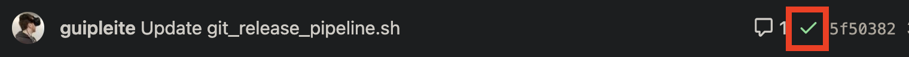
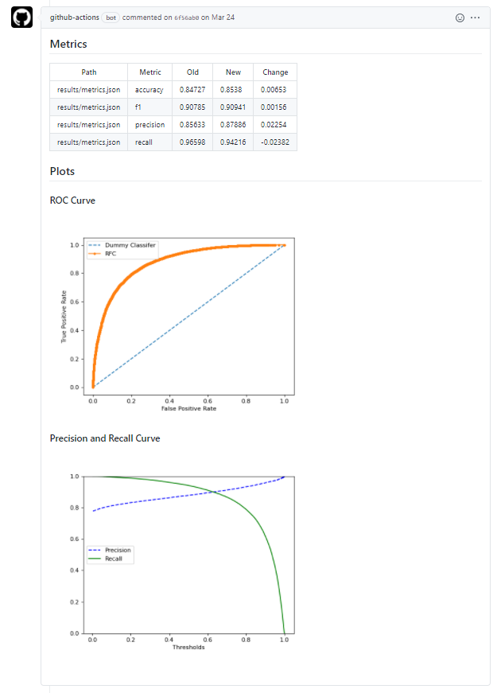

# Continuous Integration with CML and Github Actions

## What is CML?

CML, which stands by Continuous Machine Learning, it's an open-source library focused on delivering CI/CD for machine learning projects. Its principles includes:
 GitFlow: Using Git workflow for managing experiments alongside DVC versioning data and models.
Auto reports for experiments: CML can generate reports in pull requests with metrics and plots helping the team to make informed and data-driven decisions
Technology Agnostics: Build pipelines with Github or Gitlab and run experiments with any cloud service.
Since we are using Github as our Git repository, Github Actions will be used to set up CML. Github Actions is managed by Github, so there is no need to worry about scale and operate the infrastructure just as other tools like Jenkins.


## Testing With Github Actions

First, we will make sure our tests created at the [Testing with Pytest and Black](/CICD/tests/) section are being executed every time that there is a new *push* to the repository on Github. This important in order to achieve redundancy in testing the project, and avoid making sure the code runs without errors on any environment and not just the developer's computer.

To do this is very simple. If you used cookiecutter you should already have a file named **test_on_push.yaml** at ```.github/workflows/``` folder. The content of the file should be:

```yaml
name: Python Package and Test
	 
	on: [push]
	 
	jobs:
		build:
		
		runs-on: ubuntu-latest
		strategy:
		matrix:
			python-version: [3.6]
		
		steps:
		- uses: actions/checkout@v2
		- name: Set up Python ${{ matrix.python-version }}
		uses: actions/setup-python@v2
		with:
		python-version: ${{ matrix.python-version }}
		- name: Install dependencies
		run: |
		python -m pip install --upgrade pip
		pip install pytest black
		if [ -f requirements.txt ]; then pip install -r requirements.txt; fi
		- name: Test with pytest
		run: |
		pytest
		- name: Python Black
		run: |
		black . --check
```

Now, we should take a look into those commands.

***Choosing when this action will run***
```yaml
on: [push]
```
Makes it run every time there is a push on the repository


***Setting up a Github Instance to run it***
```yaml
runs-on: ubuntu-latest
```
Github will setup a free Ubuntu instance for us, using the latest official release.

***Chosing the right version of Python***
```yaml
matrix:
	python-version: [3.6]
```

***Installing test requirements***
```yaml
python -m pip install --upgrade pip
pip install pytest black
```

***Installing project requirements***
```yaml
if [ -f requirements.txt ]; then pip install -r requirements.txt; fi
```

***Running Pytest***
```yaml
- name: Test with pytest
	run: |
	pytest
```

***Running Black check***
```yaml
- name: Python Black
	 run: |
	 black . --check
```
This checks that every Python file is formatted according to Black.

If all tests pass the commit pushed to the repository will receive a green check show it has no errors. 



## Pipeline Test 

After setting up our test on push, let's focus on reproducing our pipeline on push and generate an automated report in pull requests to compare the experiment with the model at the main branch.

### Configuring Credentials

To reproduce our experiment pipeline, we need to start pulling our data versioned by DVC. On the other hand, Github Actions will execute our pipeline inside a container pre-configured by CML that doesn't have our IBM credentials to pull the data from IBM COS. So, to solve this, let's configure our IBM credentials in Github Secrets.

Github Secrets is a repository tool that encrypts credentials to be used as environment variables in the project.

- Go to the repository settings


- On the left menu, click on 'Secrets'


- Click on 'New repository secret'


- Add both ```AWS_ACCESS_KEY_ID``` and ```AWS_SECRET_ACCESS_KEY```


### Adding Train and Evaluate Workflow

Just like we did at the *Testing Setup*, let's create a file named **train_evaluate.yaml** at the ```.github/workflows/``` folder, which content should be:

```yaml
name: model-training-evaluate
	on: [push]
	jobs:
	 run:
	 runs-on: [ubuntu-latest]
	 container: docker://dvcorg/cml-py3:latest
	 steps:
	 - uses: actions/checkout@v2
	 - name: 'Train and Evaluate model'
	 shell: bash
	 env:
	 repo_token: ${{ secrets.GITHUB_TOKEN }}
	 AWS_ACCESS_KEY_ID: ${{ secrets.AWS_ACCESS_KEY_ID }}
	 AWS_SECRET_ACCESS_KEY: ${{ secrets.AWS_SECRET_ACCESS_KEY }}
	 run: |
	 # Install requirements
	 pip install -r requirements.txt
	
	 # Pull data & run-cache from IBM COS and reproduce pipeline
	 dvc pull --run-cache
	 dvc repro
	
	 # Report metrics
	 echo "## Metrics" >> report.md
	 git fetch --prune
	 dvc metrics diff master --show-md >> report.md
	
	 # Publish ROC Curve and 
	 echo -e "## Plots\n### ROC Curve" >> report.md
	 cml-publish ./results/roc_curve.png --md >> report.md
	 echo -e "\n### Precision and Recall Curve" >> report.md
	 cml-publish ./results/precision_recall_curve.png --md >> report.md
	 cml-send-comment report.md
```

Let's dig into each command:

***Setting up a CML pre-configured container***
```yaml
container: docker://dvcorg/cml-py3:latest
```

***Setting up environment credentials for IBM COS***
```yaml
env: repo_token: ${{ secrets.GITHUB_TOKEN }} 
AWS_ACCESS_KEY_ID: ${{ secrets.AWS_ACCESS_KEY_ID }}
AWS_SECRET_ACCESS_KEY: ${{ secrets.AWS_SECRET_ACCESS_KEY}}
```

***Installing requirements***
```yaml
pip install -r requirements.txt
```

***Pull the versioned data and reproduce the full pipeline of training and evaluation***
```yaml
dvc pull --run-cache
dvc repro
```

***Formatting report section tittles***
```yaml
echo "## Metrics" >> report.md
echo -e "## Plots\n### ROC Curve" >> report.md
echo -e "\n### Precision and Recall Curve" >> report.md
```

***Comparing metrics and publishing it to the report***
```yaml
dvc metrics diff master --show-md >> report.md
```

***Publishing figures from the experiment to the report***
```yaml
cml-publish ./results/roc_curve.png --md >> report.md
cml-publish ./results/precision_recall_curve.png --md >> report.md
```

***Return the final report formatted as a comment on the Commit or Pull Request***
```yaml
cml-send-comment report.md
```

The Report should look like the following:
(.zoom)
