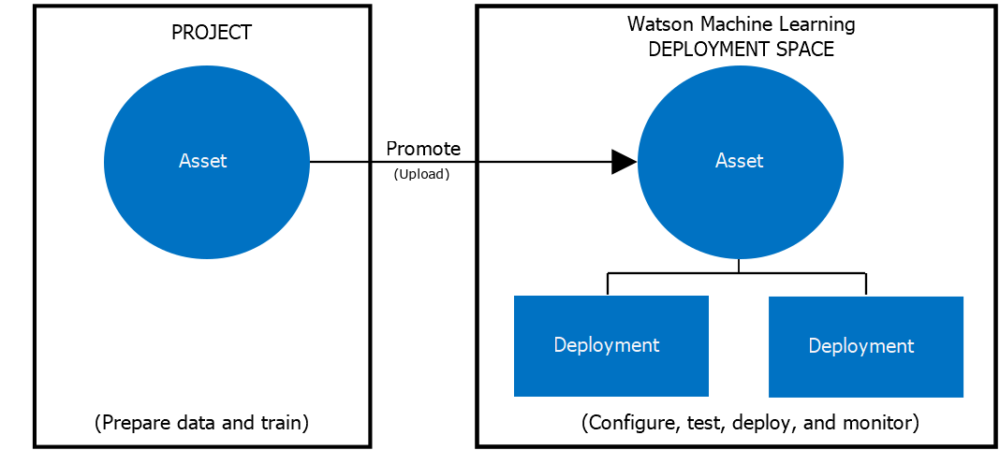

# Deployment with Watson Machine Learning

### What is Watson Machine Learning?

[Watson Machine Learning](https://dataplatform.cloud.ibm.com/docs/content/wsj/analyze-data/ml-overview.html) (WML) is a service from the IBM Cloud suite that supports popular frameworks such as TensorFlow, PyTorch, and Keras to build and deploy models. Using this tool we can store, version and deploy models via online deployment. 

After creating and training a ML model we can upload it as an *Asset* in the Deployment Space, in the IBM Cloudpak. When we create a new deployment, we choose what model asset we want the deployment to reference:

[IBM Dataplatform Deocumentation](https://dataplatform.cloud.ibm.com/docs/content/wsj/wmls/wmls-deploy-overview.html) 

### Deployment using Python API  

To deploy our ML model, we will use IBM's Watson Machine Learning, which will allow us to easily deploy the model as a web service. Since we want to automatize pipelines, we will be creating scripts using the [WML Python API](http://ibm-wml-api-pyclient.mybluemix.net/).


!!! Note
    The complete script can be found on our [example repository](https://github.com/mlops-guide/dvc-gitactions/blob/master/src/scripts/Pipelines/model_deploy_pipeline.py)

The deployment scrip takes  the path to the trained model, the path to the root of the project containing the ```metadata.yaml``` file, and the credentials file.


```python
python3 model_deploy_pipeline.py ./model_file ../path/to/project/ ../credentials.yaml
```

1. Using these arguments constant variables are set
        import os
        import sys
        import yaml

        MODEL_PATH = os.path.abspath(sys.argv[1])
        PROJ_PATH = os.path.abspath(sys.argv[2])
        CRED_PATH = os.path.abspath(sys.argv[3])
        META_PATH = PROJ_PATH + "/metadata.yaml"

2. After that, the ```yaml``` files are loaded as dictionaries and the model is loaded (using either ```joblib``` or ```pickle```).

        
        with open(CRED_PATH) as stream:
            try:
                credentials = yaml.safe_load(stream)
            except yaml.YAMLError as exc:
                print(exc)


        with open(META_PATH) as stream:
            try:
                metadata = yaml.safe_load(stream)
            except yaml.YAMLError as exc:
                print(exc)

        with open(MODEL_PATH, "rb") as file:
            # pickle_model = pickle.load(file)
            pipeline = joblib.load(file)

3. The next step is to create an instance of the IBM Watson ```client``` , to do that the credential loaded above will be used and a default [Deployment Space](paginaDoDeploySpace) will be set using the ID contained in the credentials file, other constants will be set with information’s regarding the model found on the ```metadata``` file.

        from ibm_watson_machine_learning import APIClient

        wml_credentials = {"url": credentials["url"], "apikey": credentials["apikey"]}

        client = APIClient(wml_credentials)
        client.spaces.list()

        MODEL_NAME = metadata["project_name"] + "_" + metadata["project_version"]
        DEPLOY_NAME = MODEL_NAME + "-Deployment"
        MODEL = pipeline
        SPACE_ID = credentials["space_id"]

        client.set.default_space(SPACE_ID)

4. Before the deployment, we need to give Watson some characteristics from our model, such as name, type (in this case is  ```scikit-learn_0.23```) and specifications of the instance that will run the micro-service. Next, the model is stored as an ```Asset``` on Watson ML.

        model_props = {
            client.repository.ModelMetaNames.NAME: MODEL_NAME,
            client.repository.ModelMetaNames.TYPE: metadata["model_type"],
            client.repository.ModelMetaNames.SOFTWARE_SPEC_UID: client.software_specifications.get_id_by_name(
                "default_py3.7"
            ),
        }

        model_details = client.repository.store_model(model=MODEL, meta_props=model_props)
        model_uid = client.repository.get_model_uid(model_details)

5. Once completed, we'll give the deployment a name and then deploy the model using the store ID obtained in the previous step.

        deployment_props = {
            client.deployments.ConfigurationMetaNames.NAME: DEPLOY_NAME,
            client.deployments.ConfigurationMetaNames.ONLINE: {},
        }

        deployment = client.deployments.create(
            artifact_uid=model_uid, meta_props=deployment_props
        )

6. Finally, the storage and deployment IDs are added or updated to in the ```metadata.yaml``` file.

        deployment_uid = client.deployments.get_uid(deployment)

        metadata["model_uid"] = model_uid
        metadata["deployment_uid"] = deployment_uid

        f = open(META_PATH, "w+")
        yaml.dump(metadata, f, allow_unicode=True)

### Accessing Model Predictions

Having deployed the model, we can access it's predictions by sending requests to an end-point or by using the Python ```ibm_watson_machine_learning``` library, where we can send either features for a single prediction or payloads containing multiple lines of a dataframe, for example.

The payload body is made of the dataframe column names under the ```"fields"``` key and the features under ``` "values"``` .


=== "Watson API"

    ```python
    payload = {
        "input_data": [
            {
                "fields": X.columns.to_numpy().tolist(),
                "values": X.to_numpy().tolist(),
            }
        ]
    }

    result = client.deployments.score(DEPLOYMENT_UID, payload)
    ```

=== "Requests"

    ```python
    import requests

    url = "https://us-south.ml.cloud.ibm.com/ml/v4/deployments?space_id=<string>&tag.value=<string>&asset_id=<string>&version=2020-09-01"

    payload = {
        "input_data": [
            {
                "fields": X.columns.to_numpy().tolist(),
                "values": X.to_numpy().tolist(),
            }
        ]
    }    
    
    headers= {}

    response = requests.request("GET", url, headers=headers, data = payload)

    print(response.text.encode('utf8'))

    ```


The model response will contain the scoring result containing prediction and corresponding  probability. In the case of a binary classifier, the response will have the following format:

    [1, [0.06057910314628456, 0.9394208968537154]],
    [1, [0.23434887273340754, 0.7656511272665925]],
    [1, [0.08054183674380211, 0.9194581632561979]],
    [1, [0.07877206037184215, 0.9212279396281579]],
    [0, [0.5719774367794239, 0.42802256322057614]],
    [1, [0.017282880299552716, 0.9827171197004473]],
    [1, [0.01714869904990468, 0.9828513009500953]],
    [1, [0.23952044576217457, 0.7604795542378254]],
    [1, [0.03055527110545664, 0.9694447288945434]],
    [1, [0.2879899631347379, 0.7120100368652621]],
    [0, [0.9639766912352016, 0.03602330876479841]],
    [1, [0.049694416576558154, 0.9503055834234418]],

!!! Warning
    This consumes CUH. Watson Machine Learning CUH are used for running experiments, so there is a limit on how many times you can make requests to the model on a Free Tier.

### Updating the Model
Updating the asset containing the model and/or updating the deployment. 


!!!Note
    The complete scripts for the [deployment](https://github.com/mlops-guide/dvc-gitactions/blob/master/src/scripts/Pipelines/model_update_deployment_pipeline.py) and [model](https://github.com/mlops-guide/dvc-gitactions/blob/master/src/scripts/Pipelines/model_update_pipeline.py) can be found on our template repository.

1. Firstly we need to update the model asset in WML by passing the new model as well as a name.


        print("\nCreating new version")

        published_model = client.repository.update_model(
            model_uid=MODEL_GUID,
            update_model=model,
            updated_meta_props={
                client.repository.ModelMetaNames.NAME: metadata["project_name"]
                + "_"
                + metadata["project_version"]
            },
        )

2. After that a new revision can be created.

        new_model_revision = client.repository.create_model_revision(MODEL_GUID)

        rev_id = new_model_revision["metadata"].get("rev")
        print("\nVersion:", rev_id)

        client.repository.list_models_revisions(MODEL_GUID)

3. Finally we can update the deployment.

        change_meta = {client.deployments.ConfigurationMetaNames.ASSET: {"id": MODEL_GUID}}

        print("Updating the following model: ")
        print(client.deployments.get_details(DEPLOYMENT_UID))

        client.deployments.update(DEPLOYMENT_UID, change_meta)


### Model Rollback
We have previously created revisions of a model, to rollback the model version, we'll list all the revisions made.

!!!Note 
    [Complete script](https://github.com/mlops-guide/dvc-gitactions/blob/0.0.11/src/scripts/Pipelines/model_redeploy_pipeline.py)

1. Listing the revisions.

        client.repository.list_models_revisions(MODEL_GUID)

    Output:

        --  -------------  ------------------------
        ID  NAME           CREATED
        3   Rain_aus_v0.3  2021-03-31T18:28:07.771Z
        2   Rain_aus_v0.3  2021-03-31T18:28:07.771Z
        1   Rain_aus_v0.3  2021-03-31T18:28:07.771Z
        --  -------------  ------------------------

2. Now we can choose which revision we want to rollback to and then update the deployment referencing that revision ID.

        MODEL_VERSION = input("MODEL VERSION: ")

        meta = {
            client.deployments.ConfigurationMetaNames.ASSET: {
                "id": MODEL_GUID,
                "rev": MODEL_VERSION,
            }
        }
        updated_deployment = client.deployments.update(
            deployment_uid=DEPLOYMENT_UID, changes=meta
        )

3. Finally, we'll wait for the update to finish so we can see if it was successful.

        status = None
        while status not in ["ready", "failed"]:
            print(".", end=" ")
            time.sleep(2)
            deployment_details = client.deployments.get_details(DEPLOYMENT_UID)
            status = deployment_details["entity"]["status"].get("state")

        print("\nDeployment update finished with status: ", status)
