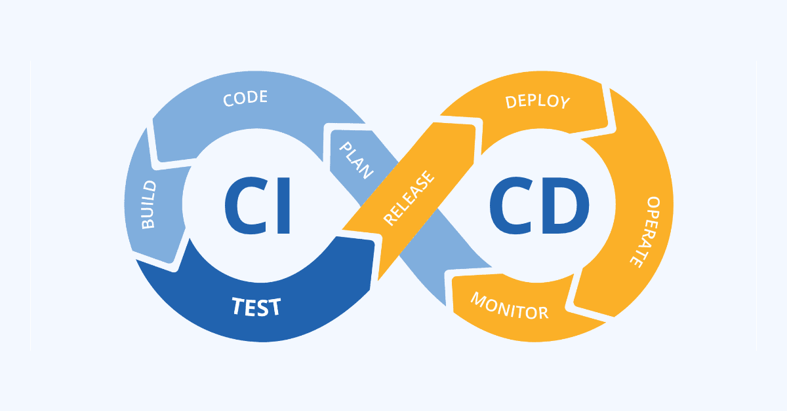

# CI/CD for Machine Learning 

Just like in DevOps, CI/CD is a method to make changes more frequently by automating the development stages. In machine learning(ML) this stages are different than a software development, a model depends not only on the code but also the data and hyperparameters, as well as deploying a model to production is more complex too.

[^]: Image from Cloud HM blog. https://blog.cloudhm.co.th/ci-cd/
## Continuous Integration (CI)

Continuous integration in ML means that every time a code or data is updated the ML pipeline reruns, this is done in a way that everything is versioned and reproducible, so it is possible to share the codebase across projects and teams. Every rerun may consist in training, testing or generating new reports, making easier to compare between other versions in production.

Note that, it is possible and recommended to run code tests too, for example, ensuring the code is in certain format, dataset values, such as NaN or wrong data types or functions outputs.

Some examples of a CI workflow:

- running and versioning the training and evaluation for every commit to the repository.
- running and comparing experiment runs for each Pull Request to a certain branch.
- trigger a new run periodically.

## Continuous Deployment (CD)

Continuous deployment is a method to automate the deployment of the new release to production, or any environment such as staging. This practice makes it easier to receive users' feedback, as the changes are faster and constant, as well as new data for retraining or new models.

Some examples of CD workflow:

- Verify the requirements on the infrastructure environment before deploying it.
- Test the model output based on a known input.
- Load testing and model latency.
  
## Popular CI/CD tools for Machine Learning

There still aren't many alternatives for CI/CD in regards of Machine Learning. Regular CI/CD can be used if correctly implemented, such as running tests, deploy scripts, etc. focused on the MLOps environment. Although there are some tools preferred for most projects.

| Tools                             | License           | Developer  | Observations |
| --------------------------------- |:-----------------:|:----------:|:------------ |
| CML (Continuous Machine Learning) | Open-source       | Iterative  | Most popular tools for CI/CD specific for Machine Learning. By the same developers of DVC, it can be integrated into it. Can be easily used with Github Actions or Gitlab CI/CD.|
| Jenkins                          | Open-source       | Jenkins CI | Jenkins is a popular tool for regular CI/CD that can be used for Machine Learning after some configuration. It is a popular choice among some MLOps projects that intend to run tests on local hardware or heavily configured cloud services.|

