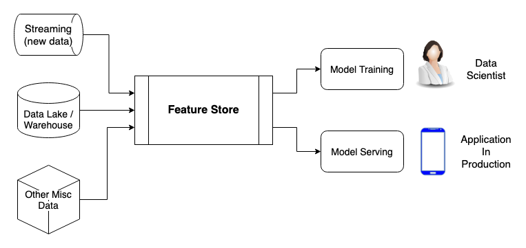
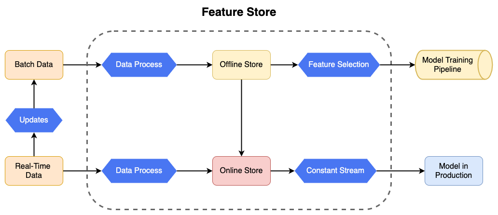

# Feature Storing

## What is a Feature Store?
Feature Stores are components of data architecture that are becoming increasingly popular in the Machine Learning and MLOps environment. The goal of a Feature Store is to process data from various data sources at the same time and turn it into features, which will be consumed by the model training pipeline and the model serving. The concept of Feature Stores is novice and rapidly changing, therefore this page has the objective of showing the key features that are more common among the main Feature Stores in the market, but at the same time it is important to note that some of the tools and frameworks in the market might not comprehend all those exact characteristics in the same manner. 

### Why it matters?
Feature Stores can be very useful for Machine Learning in production and are very reliable ways to manage features  for research and training using Offline Stores, as it is to manage the feeding of features to a model served in production using an Online Store. This data component can manage to comprehend a wide spectrum of different projects and necessities, some of which are seen below.

#### Key Features

- Enables features to be shared by multiple teams of Data Scientists working at the same time.
- Creates a reliable automated preprocess pipeline of large quantities of data.
- Can use and combine different data sources, such as data lakes, data warehouses and streaming of new data, all at once.
- Provides relevant and online features to a model in production.
- Can use a time windows system for Data Scientists to gather features from any point in time.
- Highly customizable for different model needs of consumption, such as batch or real-time predictions.

### Offline Store vs Online Store
Feature Stores combine multiple data sources and preprocess those into features, the main types of data are:

- **Batch Data**: Usually coming from Data Lakes or Data Warehouses. Those are big chunks of data that have been stored in order to be used by models and are not necessarily updated in real-time. Example: Data from customers of a bank, such as age, country, etc.

- **Real-time Data**: Usually coming from Streaming and Log events. Those the online data that are constantly coming from sources like the events logged on a system. Example: A transaction in a bank is logged in real-time and fed to the Feature Store.

Those types of data are combined inside and form two types of stores: 

- **Offline Stores:** Store composed of preprocessed features of Batch Data, used for building a historical source of features, that can be used by Data Scientists in the Model Training pipeline. With it's historical components, in most Feature Stores it can be used to provide a series of features at a given time frame or time point. It is normally stored in data warehouses, like IBM Cloud Object Storage, Apache Hive or S3, or in databases, like PostgreSQL, Cassandra and MySQL, but it can also be used in other kinds of systems, like HDFS.
- **Online Stores:** Store composed of data from the Offline Store combined with real-time preprocessed features from streaming data sources. It is built with the objective of being the most up-to-date collection of organized features, which can be used to feed the Model in Production with new features for prediction. It is normally stored in databases for rapid access, like MySQL, Cassandra, Redis, but it can be stored in more complex systems.  

## Common Architecture

## Popular Feature Stores
Many companies relay on proprietary software to develop Feature Stores, since many try to make a component that fits into their exactly use-case, such a as:

| Tools        | License           | Developer  | Observations |
| ------------ |:-----------------:|:----------:|:------------ |
| Michelangelo | Proprietary       | Uber       | Uber's platform for Machine Learning, focused on sharing feature pipelines with various teams. (Not open for public usage)
| Zipline      | Proprietary       | AirBnB     | Airbnb’s Declarative Feature Engineering Framework (Not open for public usage)
| Metaflow     | Proprietary       | Netflix    | Netflix's human friendly Python/R library for Machine Learning. Has robust Feature Engineering and other attributes. (Open for public usage and  contribution)
| Feast        | Open-source       | Feast-dev, Tecton| Popular open-source Feature Store. Very complete and competent data platform with Python, Spark and Redis. Integrates with many systems and is very customizable. Can be set up with Kubernetes.
| Hopsworks    | Open-source       | LogicalClocks| Open-source Feature Store. Used by Amazon Sagemaker. Very hardware demanding.
| Butterfree   | Open-source       | QuintoAndar| Open-source tool used for building Feature Stores using Python and Spark.

