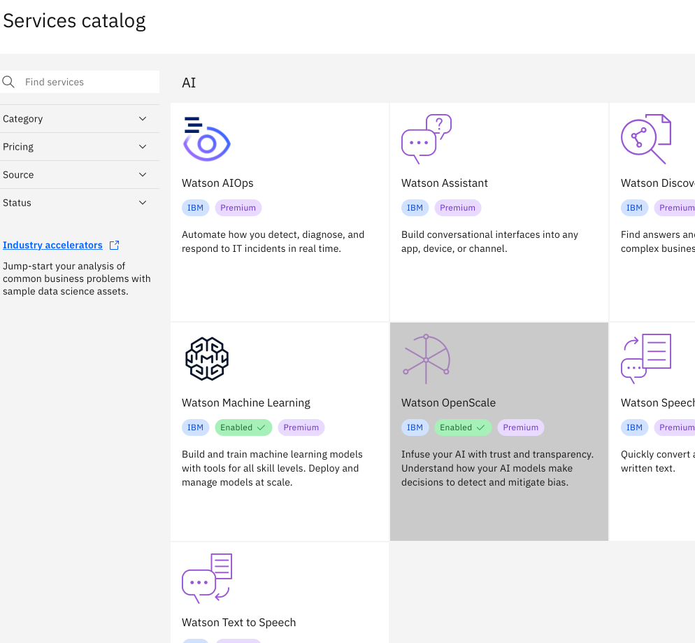
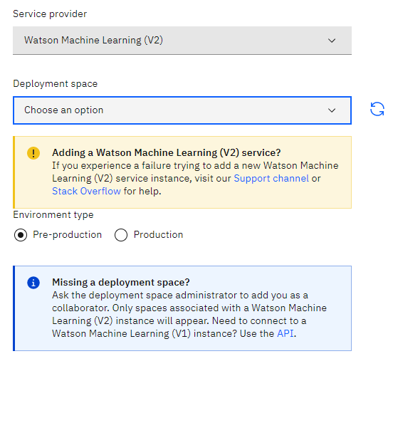
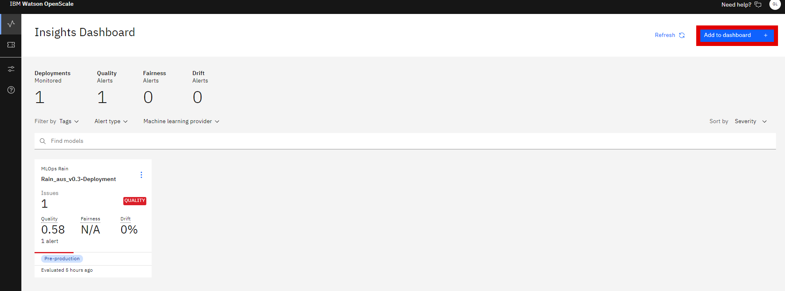
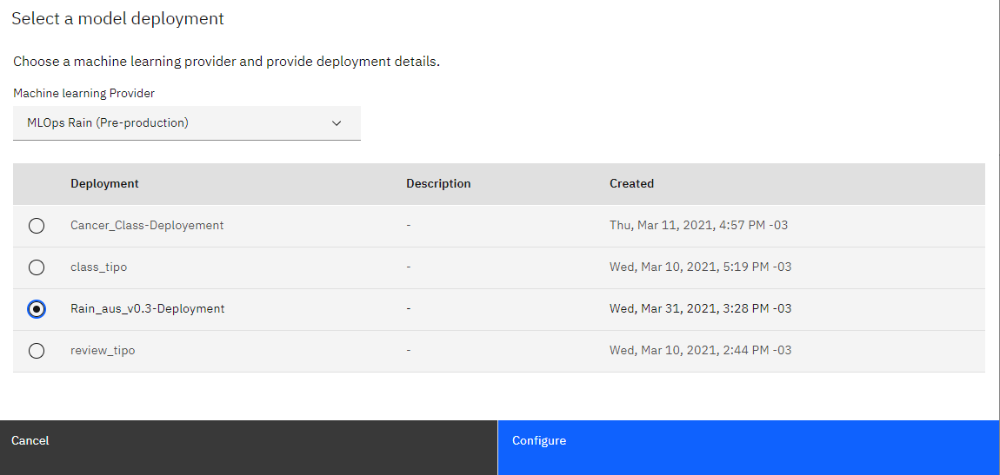
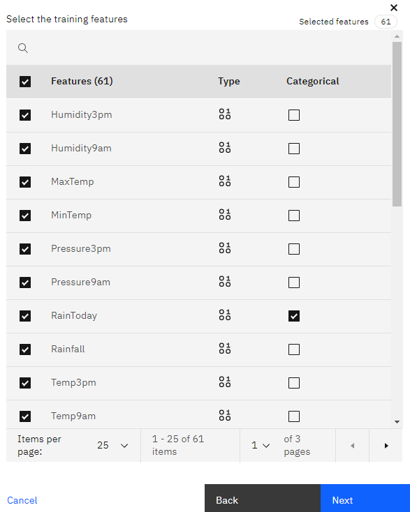
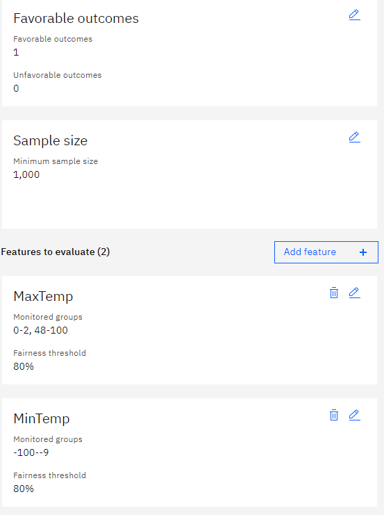
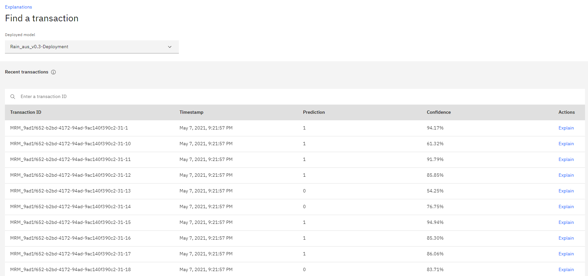
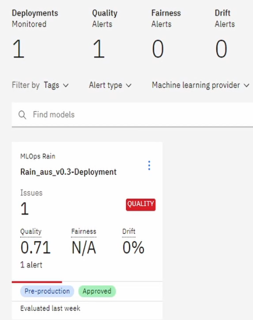

# Monitoring with IBM OpenScale

### Setting Up the Environment
1. Creating OpenScale service from the [Services Catalog](https://cloud.ibm.com/catalog/services/watson-openscale)
   <div style="text-align:center"></div>

2. Creating Machine Learning Provider

    On the Machine Learning  Provider Tab, click on the ```Add machine learning provider``` button.
    <div style="text-align:center"></div>

    2.1 Add a name and description.

    <div style="text-align:center"></div>

    2.2 Add connections  and Select Deployment Space
    Under ```Service Provider```, select ```Watson Machine Learning (V2)``` from the dropdown. Next select the deployment space your model is located in.
    <div style="text-align:center"></div>
  

3. Adding to Dashboard
    3.1 On the ```Insights Dashboard```, click on the ```Add to dashboard``` button.
    <div style="text-align:center"></div>
    3.2 Next select the provider you just created, then select your model deployment and click on ```Configure``` and then ```Configure Monitors```.

     <div style="text-align:center"></div>

    3.3 Select the data and algorithm  types, in our example it is a Binary Classification.

    3.4 The next step is selecting the training data that can be stored on a Db2 database or in IBM's Cloud Object Storage.

     <div style="text-align:center"></div>

    3.5 Now select the Label column (column you want to predict).
    
    3.6 Next we select all the features we want to include as well as indicate which ones are categorical.
    <div style="text-align:center"></div>

    3.7 Here we can select Automatic Logging.

    3.8 Finally, we can select ```prediction``` and ```probability``` for the model output.

4. Configuring Monitors
    We can create monitors for ```Fairness```,  ```Quality```. ```Drift``` and ```Explainability```.

    4.1 __Fairness:__ The monitor checks your deployments for biases. It tracks when the model shows a tendency to provide a favorable (preferable) outcome more often for one group over another. 

    We have to specify which values represent favorable outcomes and then select the features to monitor for bias, in our case we chose to monitor extreme temperatures in the ```MinTemp``` and ```MaxTemp``` columns.
     <div style="text-align:center"></div>

    4.2 __Quality:__ This monitor evaluates how well the model predicts accurate outcomes that match labeled data. It identifies when model quality declines, so we can retrain your model if needed.

    We can set the Quality Threshold value, which Area under ROC, at 0.8.

    4.3 __Drift:__ The drift evaluation measures drop in accuracy by estimating the drop in accuracy from a base accuracy score determined by the training data and also drops in data consistency, by estimating the drop in data consistency by comparing recent model transactions to the training data.

    We can set the Drift threshold as 20%.

    4.4 __Explainability:__ This allows us to reveal which features contributed to the model’s predicted outcome for a transaction and suggests what changes would result in a different outcome.
    
    We can set all features as controllable.

### Logging 
In the ```Transactions``` page, we can see informations about transactions, including a Timestamp, Prediction and Confidence.

 <div style="text-align:center"></div>

#### We can also access and generate Logs via the Python API

1. First we need to initialize  the Watson Machine Learning and OpenScale clients as well as the IAMAuthenticator.

        service_credentials = {
            "apikey": credentials["apikey"],
            "url": "https://api.aiopenscale.cloud.ibm.com",
        }

        DEPLOYMENT_UID = metadata["deployment_uid"]
        MODEL_UID = metadata["model_uid"]
        MODEL_NAME = metadata["project_name"] + "_" + metadata["project_version"]
        SPACE_ID = credentials["space_id"]
        WOS_GUID = get_instance_guid(api_key=service_credentials["apikey"])
        WOS_CREDENTIALS = {
            "instance_guid": WOS_GUID,
            "apikey": service_credentials["apikey"],
            "url": "https://api.aiopenscale.cloud.ibm.com",
        }

        if WOS_GUID is None:
            print("Watson OpenScale GUID NOT FOUND")
        else:
            print(WOS_GUID)
            
        wml_credentials = {"url": credentials["url"], "apikey": credentials["apikey"]}

        wml_client = ibm_watson_machine_learning.APIClient(wml_credentials)

        wml_credentials = {
            "url": credentials["url"],
            "apikey": credentials["apikey"],
            "instance_id": "wml_local",
        }

        wml_client.set.default_space(SPACE_ID)

        authenticator = IAMAuthenticator(apikey=credentials["apikey"])
        wos_client = ibm_watson_openscale.APIClient(
            authenticator=authenticator, 
            service_url="https://api.aiopenscale.cloud.ibm.com")

2. Then we can get the model's scoring endpoint.

    
        for deployment in wml_client.deployments.get_details()['resources']:
            if DEPLOYMENT_UID in deployment['metadata']['id']:

                scoring_endpoint = deployment['entity']['status']['online_url']['url']
                
        print(scoring_endpoint)

        https://us-south.ml.cloud.ibm.com/ml/v4/deployments/e02e481d-4e56-470f-baa9-ae84a583c0a8/predictions


3. Here we display the OpenScale subscriptions.

        wos_client.subscriptions.show()

4. Now we can load a dataset and then create the request body to make the predictions.

        df_data = pd.read_csv("../data/weatherAUS_processed.csv")

        X = df_data.iloc[:, :-1]
        y = df_data[df_data.columns[-1]]
        X_train, X_test, y_train, y_test = train_test_split(
            X, y, test_size=0.01, random_state=1337
        )

        payload_scoring = {
            "input_data": [
                {
                    "fields": X.columns.to_numpy().tolist(),
                    "values": X_test.to_numpy().tolist(),
                }
            ]
        }

5. Then we send the request to our model.

        scoring_response = wml_client.deployments.score(DEPLOYMENT_UID, payload_scoring)

6. After that, we use the ```subscription_id``` we got from step 3. we get the Payload data set ID.

        subscription_id = 'bb7a45c3-15ad-4932-aeb8-8d32d54b8b05'

        payload_data_set_id = wos_client.data_sets.list(type=DataSetTypes.PAYLOAD_LOGGING, target_target_id=subscription_id, target_target_type=TargetTypes.SUBSCRIPTION).result.data_sets[0].metadata.id

        print("Payload data set id:", payload_data_set_id)


        Payload data set id: f4791725-24f8-4a00-9c13-b331ebca47f6

7. Now we can manually create logs with the predictions from our model and the data we sent in the request.

        records = [PayloadRecord(request=payload_scoring, response=scoring_response, response_time=72)]
        store_record_info = wos_client.data_sets.store_records(payload_data_set_id, records)

8. We also can do the same thing for ```Feedback``` datasets, which don't require the model prediction.

        feedback_dataset = wos_client.data_sets.list(type=DataSetTypes.FEEDBACK, 
                                                target_target_id=subscription_id, 
                                                target_target_type=TargetTypes.SUBSCRIPTION).result

        feedback_dataset_id = feedback_dataset.data_sets[0].metadata.id
        if feedback_dataset_id is None:
            print("Feedback data set not found. Please check quality monitor status.")
            sys.exit(1)

        data = X_test.to_dict('records')

        wos_client.data_sets.store_records(
            feedback_dataset_id, 
            request_body=data, 
            background_mode=False,
            header=True,
            delimiter=',',
            csv_max_line_length=1000)

        print(wos_client.data_sets.get_records_count(data_set_id=feedback_dataset_id))

9. After that we can access these datasets as Pandas dataframes.

        records2 = wos_client.data_sets.get_list_of_records(data_set_id=payload_data_set_id,output_type=ResponseTypes.PANDAS)

        df = records2.result

10. Then we can use that Pandas dataframe to create plots or other forms of analysis.

        import matplotlib.pyplot as plt

        plt.hist(df.prediction_probability)
        plt.legend(title='Predictions Probability Histogram')
        plt.show()

    <div style="text-align:center"></div>

### Evaluating Model
On the main ```Insights Dashboard``` when click on our deployment, we can evaluate  or model by clicking on the ```Actions``` button on the top-right and then ```Evaluate now``` in dropdown, where we can import a test dataset by either directly uploading a ```.csv``` file or by using dataset or database stored in the IBM COS.

<div style="text-align:center"></div>

After that, the metrics we defined for the monitors will be used to generate reports depicting our model's performance.

<div style="text-align:center"></div>


### Explaining Predictions
Again, in the ```Transactions``` page, we can click on the ```Explain``` button, in the following page we can observe each features' relative weight indicating how strongly they influenced the model’s predicted outcome.

[](../assets/Openscale/Capture11.PNG)

In the ```Inspect``` tab, there is a table displaying the values each  feature would have to have to alter the prediction result, here we can also change the values by hand to see what the outcome would be.

[](../assets/Openscale/Capture12.PNG)


