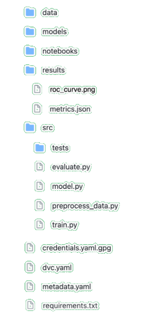

# Introduction and Project Structure

In the following sections we will go over the steps for the implemetation of a MLOps Proof-of-Concept pipeline using IBM Watson tools and services. A template repository with a complete MLOps cycle: versioning data, generating reports on pull requests and deploying the model on releases with DVC and CML using Github Actions and IBM Watson. as well as intructions to run the project can be found [here](https://github.com/MLOPsStudyGroup/dvc-gitactions).

### Folder Structure

<div style="text-align:center"></div>
The above image is the project's folder structure, we'll talk about each specific part in further details trough out the guide

- ```data``` , ```models``` and ```results``` contain files which are being stored and versioned by DVC.

- ```notebooks``` contain Jupyter Notebooks used for the exploratory analysis, development of models, or data manipulation.

- ```src``` contains scripts for training and evaluating the model as well as tests and scripts for pipelines and APIs.

### Requirements
The requirements file is a list of all of a project’s dependencies and the specific version of each dependency, including the dependencies needed by the dependencies. It can also be used to create a virtual enviroment.
This is extremely important to avoid conflits between Python libraries and also ensure the experiments can be reproduced in different machines.

### Metadata File

To keep track of the model information we have a ```metadata.yaml``` file, this helps with CI/CD and pipeline automation. Such as updating or deploying the model without the need of user input.

```yaml
author: guipleite
datetime_creted: 29/03/2021_13:46:23:802394723
model_type: scikit-learn_0.23
project_name: Rain_aus
project_version: v0.3
deployment_uid: e02e481d-4a56-470f-baa9-ae84a583c0a8
model_uid: f29e4cfc-3aab-438a-b703-fabc265f43a3
```

### Using Jupyter Notebooks vs. Python Scripts

The Jupyter Notebook is an open-source web application that allows you to create and share documents that contain live code, equations, visualizations and narrative text. It is widely used in the fields of Data Science and Machine learning for it's versatility in development and documentation of projects, however the usage of notebooks may cause some problems for our development cycle:

1. __Versioning__ : Since notebooks source code are much more complex , we can't easily visualize the difference between versions using git. There are some tools that can help with that however ...  . 

1. __Reproducibility__ : A great feature of notebooks is being able to run cells in a non-linear(??) order, but this is a big problem if we want to reproduce the code, since it's hard to know in what order or which cells where executed, this is specially bad if we want to automate pipeline.

1. __Standardized In/Out__ : By using scripts we can create pipelines with standardized entries and exits, therefore, we can create universal pipelines since no matter the model what it will recive and return will be in the same format.

1. __Access to Functions__ : In the ```model.py``` script, we define the ```train``` and ```evaluate``` function, where the model is declared and trained and the metrics for the evaluation are defined. These functions can be called by other scripts such as ```train.py``` and ```evaluate.py``` so we can create pipelines to train the model on a remote instance or evaluate an already trained model file in a consistent form.


        def train(data, params):
                ...
                return pipeline, logs


        def evaluate(data, pipeline, OUTPUT_PATH):
                ...
                return results

In our project we choose to use notebooks as a form of experimentation of models or processes and the script as a more 'definitive' form. ????????