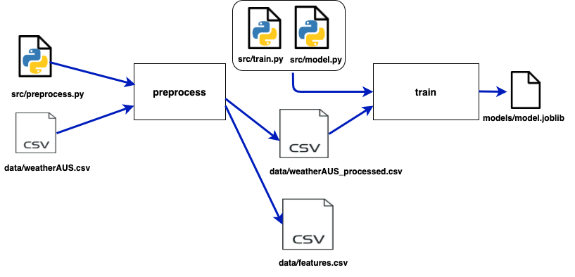

# Working with Pipelines

After learning how to version data or models using DVC it's time to build your experiment pipeline.

Let's assume that we are using the last section dataset as a data source for training a classification model. Let's also consider that we have three stages in this experiment:

- Preprocessing your data(extract features...)
- Train the model
- Evaluate the model

Here you should have in hands our scripts: [**preprocess.py**, **train.py**, **evaluate.py** and **model.py**](https://github.com/mlops-guide/dvc-gitactions/tree/master/src).

!!! warning
    Just as in the last section, we will use the help of the [template repository](https://github.com/mlops-guide/dvc-gitactions) to explain and build DVC's pipelines. Feel free to use your scripts and create specific pipelines for your project needs.

## Creating pipelines

DVC builds a pipeline based on three components: Inputs, Outputs, and Command. So for the preprocessing stage, this would look like this:

 - Inputs: weatherAUS.csv.csv and preprocess.py script
 - Outputs: weatherAUS_processed.csv
 - Command: python preprocess.py weatherAUS.csv

So to create this stage of preprocessing, we use ```dvc run```:

```bash
dvc run -n preprocess \
  -d ./src/preprocess_data.py -d data/weatherAUS.csv \
  -o ./data/weatherAUS_processed.csv \
  python3 ./src/preprocess_data.py ./data/weatherAUS.csv
```

We named this stage "preprocess" by using the flag ```-n```. We also defined this stage inputs with the flag ```-d``` and the outputs with the flag ```-o```. The command will always be the last piece of ```dvc run``` without any flag.

!!! tip
    Output files are added to DVC control when reproducing a DVC stage. When finalizing your experiment remember to use ```dvc push``` to version not only the data used but those outputs generated from the experiment.

The train stages would also be created using ```dvc run```:

```bash
dvc run -n train \
  -d ./src/train.py -d ./data/weatherAUS_processed.csv -d ./src/model.py \
  -o ./models/model.joblib \
  python3 ./src/train.py ./data/weatherAUS_processed.csv ./src/model.py 200
```

!!! Warning
    The number **200** at ```dvc run``` above is related to our script function. If your are using your own script just ignore it.

At this point, you might have noticed that two new files were created: **dvc.yaml** and ***dvc.lock***.  The first one will be responsible for saving what was described in each ```dvc run``` command. So if you wanna create or change a specific stage, it's possible to just edit ***dvc.yaml*** . Our current file would look like this:

```yaml
stages:
  preprocess:
    cmd: python3 ./src/preprocess_data.py ./data/weatherAUS.csv
    deps:
    - ./src/preprocess_data.py
    - data/weatherAUS.csv
    outs:
    - ./data/weatherAUS_processed.csv
    - ./data/features.csv
  train:
    cmd: python3 ./src/train.py ./data/weatherAUS_processed.csv ./src/model.py 200
    deps:
    - ./data/weatherAUS_processed.csv
    - ./src/model.py
    - ./src/train.py
    outs:
    - ./models/model.joblib
```

The second file created is ***dvc.lock***. This is also a YAML file and its function is similar to ***.dvc*** files. Inside, we can find the path and a hash code for each file of each stage so DVC can track changes. Tracking these changes is important because now DVC will know when a stage needs to be rerun or not.

Your currently pipeline looks likes this:




## Saving metrics

Finally, let's create our last stage so we can evaluate our model:

```bash
dvc run -n evaluate -d ./src/evaluate.py -d ./data/weatherAUS_processed.csv \
  -d ./src/model.py -d ./models/model.joblib \
  -M ./results/metrics.json \
  -o ./results/precision_recall_curve.png -o ./results/roc_curve.png \
  python3 ./src/evaluate.py ./data/weatherAUS_processed.csv ./src/model.py ./models/model.joblib

```

You might notice that we are using the -M flag instead of the -o flag. This is important because now we can keep the metrics generated by every experiment. If we run ```dvc metrics show``` we can see how good was the experiment:

```bash
$ dvc metrics show
Path                  accuracy    f1       precision    recall        
results/metrics.json  0.84973     0.90747  0.8719       0.94607
```

Another import command is if we want to compare this experiment made in our branch to the model in production at the main branch we can do this by running ```dvc metrics diff```:

```bash
$ dvc metrics diff
Path                  Metric     Old      New      Change             
results/metrics.json  accuracy   0.84643  0.84973  0.0033
results/metrics.json  f1         0.9074   0.90747  8e-05
results/metrics.json  precision  0.85554  0.8719   0.01636
results/metrics.json  recall     0.96594  0.94607  -0.01987
```

The metrics configuration is saved at the ***dvc.yaml*** file.


## Control the experiment

So now we have built a full machine learning experiment with three pipelines: 


DVC uses a Direct Acyclic Graph(DAG) to organize the relationships and dependencies between pipelines. This is very useful for visualizing the experiment process, especially when sharing it with your team. You can check the DAG just by running ```dvc dag```:

```bash
$ dvc dag

 +-------------------------+  
 | data/weatherAUS.csv.dvc |  
 +-------------------------+  
               *              
               *              
               *              
        +------------+        
        | preprocess |        
        +------------+        
         **        **         
       **            **       
      *                **     
+-------+                *    
| train |              **     
+-------+            **       
         **        **         
           **    **           
             *  *             
         +----------+         
         | evaluate |         
         +----------+   
```

If you want to check any changes to the project's pipelines, just run:

```bash
$ dvc status
```

## Reproducibility

Either if you changed one stage and need to run it again or if you are reproducing someone's experiment for the first time, DVC helps you with that:

Run this to reproduce the whole experiment:

```bash
$ dvc repro
```

Or if you want just to reproduce one of the stages, just let DVC know that by:

```bash
$ dvc repro stage_name
```

!!! info 
    If you are using ```dvc repro``` for a second time, DVC will reproduce only those stages that changes have been made.

___
