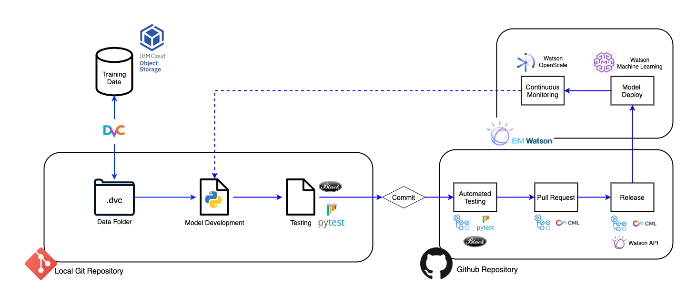

# MLOps Guide

This site is intended to be a MLOps Guide to help projects and companies to build more reliable MLOps environment. This guide should contemplate the theory behind MLOps and an implementation that should fit for most use cases. Made by [Arthur Olga](https://github.com/arthurolga), [Gabriel Monteiro](https://github.com/gabriellm1), [Guilherme Leite](https://github.com/guipleite) and [Vinicius Lima](https://github.com/ViniGl)

## What is MLOps?

MLOps is a methodology of operation that aims to facilitate the process of bringing an experimental Machine Learning model into production and maintaining it efficiently. MLOps focus on bringing the methodology of DevOps used in the software industry to the Machine Learning model lifecycle. In that way we can define some of the main features of a MLOPs project:

* Data and Model Versioning
* Feature Management and Storing
* Automation of Pipelines and Processes
* CI/CD for Machine Learning
* Continuous Monitoring of Models

## What is Contemplated on This Guide?

* Introduction to MLOps Concepts
* Tutorial for Building a MLOps Environment

## MLOps Environment
This video shows how an example of workflow with a complete MLOps project. This exact project can be found [here](https://github.com/mlops-guide/dvc-gitactions) and is an example end-to-end made for this guide.

<iframe width="560" height="315" src="https://www.youtube.com/embed/URpGaE-FA5U" title="YouTube video player" frameborder="0" allow="accelerometer; autoplay; clipboard-write; encrypted-media; gyroscope; picture-in-picture" allowfullscreen></iframe>

### Architecture
The following diagram shows the complete MLOps flow used on the tutorial. Since the guide is modular, a team can choose to swap tools at any point due to project preferences and use cases.

{.zoom}

### Project Tools
The main tools discussed in the guide are shown in the following table.

| Tools          | Function                   | Developer  | License |
| -------------- |:--------------------------|:-----------|:-----------|
| [IBM Watson ML](https://www.ibm.com/cloud/machine-learning)  | Deploying model as API     | IBM        | Proprietary |
| [IBM Watson OpenScale](https://www.ibm.com/cloud/watson-openscale)  | Monitoring Model in production     | IBM |  Proprietary |
| [DVC](https://dvc.org/)            | Data and Model Versioning  | Iterative  | Apache License 2.0 |
| [CML](https://dvc.org/doc/cml)            | Pipeline Automation        | Iterative    | Apache License 2.0 |
| [Terraform](https://www.terraform.io/)      | Setups IBM infrastructure with script | HashiCorp| Mozilla Public License v2.0 |
| [Github](https://github.com/)         | Code versioning            | Github | Proprietary |
| [Github Actions](https://github.com/features/actions) | CI/CD Automation           | Github | Proprietary |
| [Pytest](https://docs.pytest.org/)         | Python script testing      | Pytest-dev | MIT  |
| [Pre-commit](https://pre-commit.com/)     | Running tests on local commit | Pre-commit | MIT |
| [Cookiecutter](https://github.com/cookiecutter/cookiecutter)   | Creating folder structure and files | Cookiecutter | BSD 3-Clause |

## Next

MLOps Theory

[📚 Learn More About MLOps Theory](./MLOps/Data/){ .md-button .md-button--primary }
!!! tip
    It is recommended that you learn about the theory before implementing MLOps into your project

Implementation Guide

[📃 Follow the Tutorial to Start a Project](./Structure/project_structure/){ .md-button .md-button--primary }

